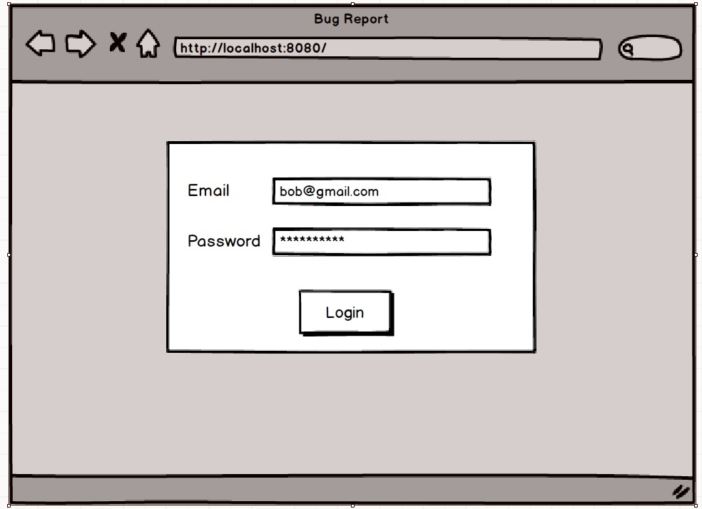
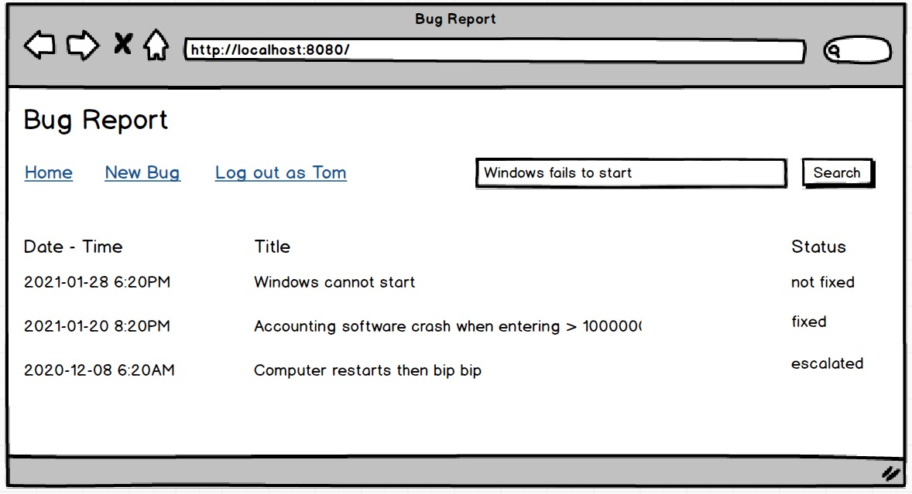
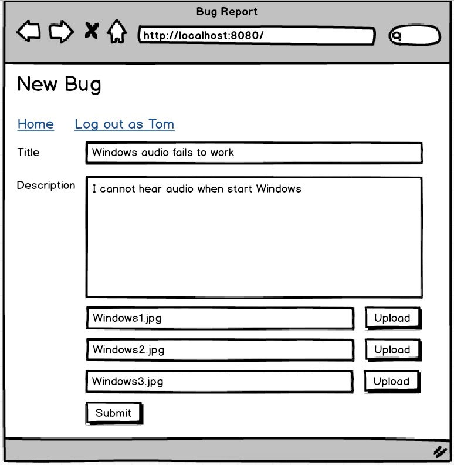

# User's Guide
1. run the app
2. access at [http://localhost:8080](http://localhost:8080)  
3. login using 1 out of 6 available accounts in [user.sql](blog/src/main/resources/user.sql)

# Xây dựng hệ thống khiếu nại báo cáo lỗi.
#### Roles - các vai trò người dùng trong hệ thống:
1. Anonymous user: chưa đăng nhập không được xem hay làm bất kỳ hành động gì
2. Customer: được phép tạo bài viết gồm title tối đa 255 ký tự, mô tả 3000 ký tự, upload tối đa 3 ảnh chụp lại lỗi để phản ánh, khiếu nại. Khách hàng cũng có trả lời, reply bài viết của mình.
   Khác hàng có thể cho điểm mức độ hài lòng của mình sau khi Supporter hỗ trợ. Điểm từ 1 đến 10.
3. Supporter: nhân viên hỗ trợ được phép reply bài viết của khách hàng hoặc chuyển trạng thái của bài viết gồm các trạng thái: hỗ trợ xong, không thể hỗ trợ, cần chuyển lên chuyên gia cấp cao hơn

Chức năng upload tham khảo ở đây [https://github.com/TechMaster/SpringBootBasic/tree/main/fileio](https://github.com/TechMaster/SpringBootBasic/tree/main/fileio)

### Yêu cầu giao diện:
#### Màn hình Mockup

Giao diện đơn giản nhất có thể nhưng hãy bắt đầu dùng Bootstrap 4. Có một khoá học Bootstrap 4 căn bản ở đây rất hay
[https://scrimba.com/learn/bootstrap4](https://scrimba.com/learn/bootstrap4)

### Dùng SpringSecurity hay tự code phần Authenticate/Authorization
Tuỳ bạn. Để đơn giản tôi sẽ cung cấp sẵn vài User và Roles, bạn tự tạo model và import. Bạn thích dùng Spring Security cũng được.